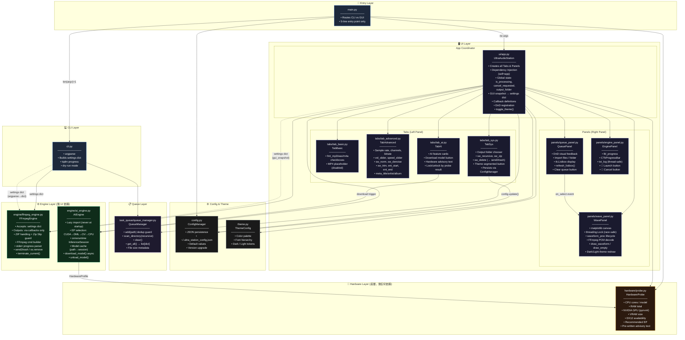
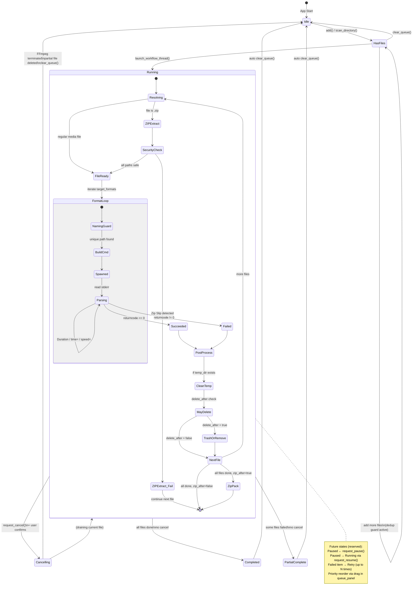

# Ultra Station — Architecture Design Document (ADD)

> **Version:** v6.1.0 · **Author:** zien0709 · **Status:** Living Document

This document is the authoritative technical reference for the `ultra_station` project.  
It describes every module, their responsibilities, data flows, state transitions, and dependency relationships at a level suitable for onboarding, code review, and future AI-assisted development.

---

## Table of Contents

1. [🏗️ Overall Architecture](#chapter-1--overall-architecture)
2. [🚀 Startup Flow](#chapter-2--startup-flow)
3. [🔄 Encoding Pipeline Flow](#chapter-3--encoding-pipeline-flow)
4. [🧵 Queue State Machine](#chapter-4--queue-state-machine)
5. [📡 Signal & Event Routing](#chapter-5--signal--event-routing)
6. [📦 Full Dependency Graph](#chapter-6--full-dependency-graph)

---

## Chapter 1 · 🏗️ Overall Architecture

This diagram shows the **complete static structure** of the project:  
all modules, layer boundaries, coordination patterns, and the universal `settings dict` interface that decouples GUI from CLI from Engine.



### Design Invariants

| Rule | Description |
|---|---|
| **Engine blindness** | `FFmpegEngine` and `AIEngine` never import `ctk`, `tk`, or any UI module. |
| **Settings dict contract** | The only input to `FFmpegEngine.run()` is a plain `dict`. Both CLI and GUI produce the identical schema. |
| **Callback-only output** | Engine outputs nothing directly — only via `progress_callback`, `log_callback`, `complete_callback`. |
| **Hardware layer isolation** | `hardware/probe.py` has zero imports from any other internal module. |
| **Lazy AI loading** | No AI library (torch, onnxruntime, demucs) is ever imported at app startup. |

---

## Chapter 2 · 🚀 Startup Flow

This sequence diagram covers **both CLI and GUI startup paths**, including hardware probing, config loading, AI lazy-loading strategy, and exception handling.

```mermaid
sequenceDiagram
    autonumber
    actor User
    participant main as main.py
    participant cfg as config.py<br/>ConfigManager
    participant probe as hardware/probe.py<br/>HardwareProbe
    participant cli as cli.py
    participant app as ui/app.py<br/>UltraAudioStation
    participant tabs as ui/tabs/*
    participant panels as ui/panels/*
    participant ffeng as engine/ffmpeg_engine.py
    participant aieng as engine/ai_engine.py

    User->>main: python main.py [args?]

    rect rgb(20, 30, 48)
        Note over main,cfg: Phase 1 · Config & Hardware (always runs)
        main->>cfg: ConfigManager()
        cfg->>cfg: load ~/.ultra_station_config.json
        cfg-->>main: settings restored

        main->>probe: probe_hardware()
        probe->>probe: psutil · RAM, CPU
        probe->>probe: pynvml · NVIDIA GPU + VRAM
        probe->>probe: wmic · DX12 availability (Windows)
        probe->>probe: _build_recommendation()
        probe-->>main: HardwareProfile{ep, advisory_text}
    end

    alt CLI Mode · len(sys.argv) > 1

        rect rgb(10, 28, 18)
            Note over main,ffeng: Phase 2A · CLI Execution
            main->>cli: parse_and_run(argv[1:])
            cli->>cli: argparse · parse flags
            cli->>cli: build settings dict
            cli->>cli: QueueManager · scan inputs
            cli->>ffeng: FFmpegEngine(profile)
            cli->>ffeng: engine.run(queue, settings,\nprogress_cb, log_cb, cancel_fn)
            ffeng-->>cli: (blocking, runs to completion)
            cli-->>User: tqdm progress + summary
        end

    else GUI Mode · no args

        rect rgb(18, 18, 40)
            Note over main,panels: Phase 2B · GUI Startup
            main->>app: launch_gui() → ModernApp() → UltraAudioStation(root)
            app->>cfg: config.get() · restore theme / output_folder
            app->>probe: (profile already in memory)
            app->>ffeng: FFmpegEngine() · verify get_exe()

            Note over ffeng: Raises on missing FFmpeg → show error dialog

            app->>tabs: TabBasic / TabAdvanced / TabAI / TabSys
            tabs->>cfg: read saved switch states → .select()
            tabs-->>app: widgets created, self refs stored

            app->>panels: QueuePanel / WavePanel / EnginePanel
            panels-->>app: cards positioned in grid

            app->>app: root.drop_target_register(DND_FILES)
            app->>app: dnd_bind <<Drop>> <<DragEnter>> <<DragLeave>>

            Note over aieng: AI libs NOT imported yet.<br/>TabAI shows locked cards.

            app-->>User: Window visible (~50ms)
        end

        opt User clicks AI feature for first time
            rect rgb(28, 10, 10)
                Note over app,aieng: Phase 3 · AI Lazy Load (on demand)
                app->>aieng: AIEngine(profile)
                aieng->>aieng: _resolve_ep(recommended_ep)
                aieng->>aieng: import onnxruntime (deferred)
                aieng->>aieng: check model cache on disk
                alt Model not downloaded
                    aieng-->>app: trigger download UI
                    app-->>User: Show download progress card
                    aieng->>aieng: requests.get() · stream download
                    aieng->>aieng: verify file integrity (size / MD5)
                end
                aieng->>aieng: InferenceSession(model_path, providers=ep)
                aieng-->>app: model ready → unlock feature card
            end
        end

    end
```



---

## Chapter 3 · 🔄 Encoding Pipeline Flow

This flowchart documents the **complete lifecycle of a single encoding job** from user interaction to file output, including ZIP handling, Zip Slip security, collision guards, filter graph construction, real-time progress parsing, and post-processing.

```mermaid
flowchart TD
    A([👆 User clicks 🚀 Launch]) --> B[Collect GUI state\nfrom all tabs]
    B --> C{Format\nchecked?}
    C -->|None| C1[⚠️ showwarning\n'Select at least one format']
    C -->|At least one| D{Trim enabled?}
    D -->|Yes| E{parse_time\nvalidate start/end}
    E -->|Invalid format| E1[⚠️ showwarning\n'Invalid time format']
    E -->|start ≥ end| E2[⚠️ showwarning\n'Start must be before End']
    E -->|OK| F
    D -->|No| F[Build gui_snapshot\nsettings dict]

    F --> G[is_processing = True\nDisable Launch\nEnable Cancel]
    G --> H[threading.Thread\ntarget=thread_task]

    H --> I["FFmpegEngine.run(\n  queue_files,\n  settings,\n  progress_callback,\n  log_callback,\n  check_cancel\n)"]

    I --> J{For each file\nin queue_files}
    J --> K{check_cancel?}
    K -->|True| ABORT([🛑 Abort loop])

    K -->|False| L{Is .zip file?}

    L -->|Yes| M[Extract to\nsrc_path + UUID_temp/]
    M --> N{Zip Slip\npath traversal\ncheck}
    N -->|Attack detected| N1[❌ log error\nshutil.rmtree temp\ncontinue next file]
    N -->|Safe| O[os.walk temp_dir\ncollect media files]

    L -->|No| P[files_to_process\n= src only]
    O --> P

    P --> Q{For each\ncurrent_file}
    Q --> R{check_cancel?}
    R -->|True| ABORT

    R -->|False| S{For each\ntarget format}
    S --> T{check_cancel?}
    T -->|True| ABORT

    T -->|False| U[Generate out_name\nbase_name.fmt]
    U --> V{Same path as\ninput?}
    V -->|Yes| V1[Rename:\nbase_name_converted.fmt]
    V -->|No| W
    V1 --> W{Output path\nalready exists?\nor in converted list?}
    W -->|Yes| W1[counter += 1\nbase_name_N.fmt]
    W1 --> W
    W -->|No, safe| X[Build FFmpeg cmd]

    X --> X1["-y" flag]
    X1 --> X2{trim enabled?}
    X2 -->|Yes| X3["-ss start\n-to end"\nbefore -i]
    X2 -->|No| X4
    X3 --> X4["-i current_file"]
    X4 --> X5{Audio filters?}
    X5 -->|volume ≠ 1.0| XF1["volume=N"]
    X5 -->|denoise| XF2["afftdn=nr=12:nt=w"]
    X5 -->|normalize| XF3["loudnorm=I=-16:TP=-1.5:LRA=11"]
    X5 -->|speed ≠ 1.0| XF4["atempo=N"]
    XF1 & XF2 & XF3 & XF4 --> X6["-filter:a\njoined chain"]
    X5 -->|None| X6
    X6 --> X7{sample_rate?}
    X7 -->|Not 保留原始| X8["-ar Hz"]
    X7 -->|Keep| X9
    X8 --> X9{channels?}
    X9 -->|Mono| X10["-ac 1"]
    X9 -->|Stereo| X11["-ac 2"]
    X9 -->|Keep| X12
    X10 & X11 --> X12{Format codec}
    X12 -->|mp3| XC1["-acodec libmp3lame\n-b:a bitrate"]
    X12 -->|m4a| XC2["-acodec aac\n-b:a bitrate"]
    X12 -->|wav| XC3["-acodec pcm_s16le"]
    XC1 & XC2 & XC3 --> X13{Metadata?}
    X13 -->|title/artist/album set| X14["-metadata key=val"]
    X13 -->|Empty| X15
    X14 --> X15[Append final_out_path]

    X15 --> Y["subprocess.Popen\nstderr=PIPE\nencoding=utf-8"]

    Y --> Z{Read stderr\nline by line}
    Z --> AA{"'Duration:'\nin line?"}
    AA -->|Yes| AB[Parse HH:MM:SS.cc\n→ duration_seconds]
    AB --> AC{trim mode?}
    AC -->|Yes| AD[Recalculate:\ntrim_end - trim_start]
    AC -->|No| AE
    AD --> AE
    AA -->|No| AE{"'time=' in line\n& duration > 0?"}
    AE -->|Yes| AF[Parse curr_seconds\nfile_progress = curr/dur\noverall_idx = f_idx/total + ...\nspeed_str from regex]
    AF --> AG["progress_callback(\n  overall_idx,\n  '({N}%) speed: Xx'\n)"]
    AG --> Z
    AE -->|No| Z
    Z -->|EOF| AH[process.wait()]

    AH --> AI{returncode == 0?}
    AI -->|0 · Success| AJ[log ✅ out_name\nconverted_files.append]
    AI -->|Non-zero| AK{check_cancel?}
    AK -->|Yes| AL[Delete partial file\nlog 🛑]
    AK -->|No| AM[log ❌ returncode]

    AJ & AL & AM --> AN{More formats?}
    AN -->|Yes| S
    AN -->|No| AO{More files?}
    AO -->|Yes| Q
    AO -->|No| AP{temp_dir exists?}
    AP -->|Yes| AQ[shutil.rmtree temp_dir]
    AP -->|No| AR

    AQ --> AR{delete_after\n& not zip & not cancelled?}
    AR -->|Yes| AS{send2trash\navailable?}
    AS -->|Yes| AT[send2trash src\nlog 🗑️ → Recycle Bin]
    AS -->|No| AU[os.remove src\nlog ⚠️ permanent]
    AR -->|No| AV
    AT & AU --> AV
    AV --> AW{zip_after\n& converted_files\n& not cancelled?}
    AW -->|Yes| AX[ZipFile.write\nall converted_files\n工作站批次產出包裹.zip]
    AW -->|No| AY

    AX --> AY([complete_callback])

    AY --> AZ{cancelled?}
    AZ -->|Yes| BA[lbl: 🛑 Terminated\nprogress_bar: red]
    AZ -->|No| BB[lbl: 🎉 Complete\nprogress_bar: green → 1.0\nclear_queue]
    BA & BB --> BC[Restore buttons:\nLaunch=normal\nCancel=disabled]
    BC --> BD[showinfo dialog]
    BD --> BE([is_processing = False])
```

---

## Chapter 4 · 🧵 Queue State Machine

This state diagram documents **every state a QueueManager and its items can be in**, including future states (Paused, Retry) that are already reserved in the architecture.



### Queue Item Schema

Every item stored in `QueueManager.files` follows this contract:

```python
{
    "src":  str,   # absolute path to source file
    "name": str,   # os.path.basename(src)
    "size": str    # "{N:.2f} MB" (pre-formatted for display)
}
```

---

## Chapter 5 · 📡 Signal & Event Routing

This diagram shows **every user interaction and its complete propagation path** through the system — from widget event to final UI update, including thread-safe `root.after()` calls back to the main thread.

```mermaid
flowchart LR
    subgraph INPUT["👆 User Input Events"]
        direction TB
        E1["🚀 Launch button\nclick"]
        E2["🛑 Cancel button\nclick"]
        E3["📄 Import Files\nbutton"]
        E4["📁 Import Folder\nbutton"]
        E5["🗑 Clear Queue\nbutton"]
        E6["Drag & Drop\n<<Drop>>"]
        E7["Drag Enter\n<<DragEnter>>"]
        E8["Drag Leave\n<<DragLeave>>"]
        E9["Listbox\n<<ListboxSelect>>"]
        E10["Theme switch\nSegmentedButton"]
        E11["Output folder\nchoose button"]
        E12["sw_recursive /\nsw_zip / sw_delete"]
    end

    subgraph COORD["🎛️ App Coordinator\nui/app.py"]
        direction TB
        FN1["launch_workflow_thread()"]
        FN2["request_cancel()"]
        FN3["clear_queue()"]
        FN4["toggle_theme()"]
        FN5["handle_drop()"]
        FN6["handle_drag_enter()"]
        FN7["handle_drag_leave()"]
    end

    subgraph CALLBACKS["🔁 Engine Callbacks\n(called from bg thread)"]
        direction TB
        CB1["progress_callback(\n  overall_idx, text\n)"]
        CB2["log_callback(\n  message\n)"]
        CB3["complete_callback()"]
        CB4["check_cancel()\n→ lambda: self.cancel_requested"]
    end

    subgraph AFTER["🔒 root.after()\nThread-Safe UI Updates"]
        direction TB
        U1["progress_bar.set(idx)"]
        U2["lbl_progress.configure(text)"]
        U3["txt_log.insert(END, msg)"]
        U4["btn_launch.configure(state)"]
        U5["btn_cancel.configure(state)"]
        U6["progress_bar.configure\n(progress_color)"]
        U7["messagebox.showinfo()"]
        U8["wave_panel.draw_waveform()"]
        U9["wave_panel.draw_empty()"]
        U10["queue_box.configure\n(bg, fg)"]
    end

    subgraph SIDE["🛠️ Side Effects"]
        direction TB
        S1["QueueManager.add()\nQueueManager.scan_directory()"]
        S2["QueueManager.clear()"]
        S3["ConfigManager.update()"]
        S4["FFmpegEngine\n.terminate_current()"]
        S5["WavePanel\n.waveform_proc.terminate()"]
        S6["queue_panel\n.refresh_listbox()"]
        S7["wave_panel\n._async_load_waveform()\nin daemon thread"]
        S8["ctk.set_appearance_mode()"]
    end

    %% Input → Coordinator
    E1 --> FN1
    E2 --> FN2
    E3 & E4 --> S1 --> S6
    E5 --> FN3
    E6 --> FN5
    E7 --> FN6
    E8 --> FN7
    E9 --> S5 --> S7 --> U8
    E10 --> FN4
    E11 --> S3
    E12 --> S3

    %% Coordinator → Callbacks
    FN1 --> CB1 & CB2 & CB3 & CB4

    %% Coordinator → Side Effects
    FN2 --> S4
    FN3 --> S2 --> S6 --> U9
    FN4 --> S8 & U10
    FN5 --> S1 --> S6
    FN6 -->|"card.configure(fg_color=hover)"| COORD
    FN7 -->|"card.configure(fg_color=orig)"| COORD

    %% Callbacks → root.after → UI
    CB1 -->|"root.after(0, ...)"| U1 & U2
    CB2 -->|"root.after(0, ...)"| U3
    CB3 -->|"root.after(0, ...)"| U4 & U5 & U6 & U7
    CB4 -.->|"read-only check"| FN2

    classDef input fill:#0f172a,stroke:#3b82f6,color:#93c5fd
    classDef coord fill:#0f2c1a,stroke:#10b981,color:#6ee7b7
    classDef cb fill:#2c1a0f,stroke:#f59e0b,color:#fcd34d
    classDef after fill:#1a1a2e,stroke:#818cf8,color:#c4b5fd
    classDef side fill:#1e1a2e,stroke:#a78bfa,color:#ddd6fe

    class E1,E2,E3,E4,E5,E6,E7,E8,E9,E10,E11,E12 input
    class FN1,FN2,FN3,FN4,FN5,FN6,FN7 coord
    class CB1,CB2,CB3,CB4 cb
    class U1,U2,U3,U4,U5,U6,U7,U8,U9,U10 after
    class S1,S2,S3,S4,S5,S6,S7,S8 side
```



### Thread Safety Rules

| Location | Thread | Allowed |
|---|---|---|
| `FFmpegEngine.run()` | Background daemon thread | Never touch `ctk`/`tk` widgets |
| `WavePanel._async_load_waveform()` | Background daemon thread | Never call `canvas.draw()` directly |
| All `root.after(0, fn, args)` | Schedules on main thread | Only safe path to update widgets |
| `check_cancel()` lambda | Background thread reads | `cancel_requested` is a plain `bool` — safe to read without lock |
| `waveform_proc` access | Background thread writes | Protected by `threading.Lock` |

---

## Chapter 6 · 📦 Full Dependency Graph

This graph shows **every import relationship** in the project — both internal modules and external pip packages — to make dependency auditing, packaging, and environment setup unambiguous.

```mermaid
graph TB
    subgraph PIP_CORE["📦 pip · Core (always installed)"]
        PKG_CTK["customtkinter"]
        PKG_TK["tkinter\n(stdlib)"]
        PKG_DND["tkinterdnd2"]
        PKG_IMAGEIO["imageio-ffmpeg"]
        PKG_NUMPY["numpy"]
        PKG_MPL["matplotlib"]
        PKG_PIL["Pillow"]
        PKG_S2T["send2trash"]
        PKG_PSUTIL["psutil"]
        PKG_PYNVML["pynvml"]
        PKG_TQDM["tqdm"]
        PKG_REQ["requests"]
        PKG_ARG["argparse\n(stdlib)"]
        PKG_JSON["json\n(stdlib)"]
        PKG_RE["re / uuid / shutil\n/ zipfile / subprocess\n(stdlib)"]
    end

    subgraph PIP_AI["📦 pip · AI Pack (optional, lazy)"]
        PKG_ORT_DML["onnxruntime-directml\n(Windows · DX12 GPU + NPU)"]
        PKG_ORT_GPU["onnxruntime-gpu\n(CUDA · NVIDIA)"]
        PKG_ORT_OV["onnxruntime-openvino\n(Intel NPU/GPU)"]
        PKG_ORT_CPU["onnxruntime\n(CPU fallback)"]
        PKG_DEMUCS["demucs\n(vocal separation)"]
        PKG_WHISPER["faster-whisper\n(auto subtitle)"]
        PKG_REMBG["rembg\n(background removal)"]
        PKG_DFN["deepfilternet\n(AI denoising)"]
    end

    subgraph INT_ROOT["🗂️ Internal · Root"]
        MAIN["main.py"]
        CLI["cli.py"]
        THEME["theme.py"]
        CONFIG["config.py"]
    end

    subgraph INT_HW["🗂️ Internal · hardware/"]
        PROBE["probe.py"]
    end

    subgraph INT_ENG["🗂️ Internal · engine/"]
        FFENG["ffmpeg_engine.py"]
        AIENG["ai_engine.py"]
    end

    subgraph INT_QUEUE["🗂️ Internal · task_queue/"]
        INIT_Q["__init__.py"]
        QM["queue_manager.py"]
    end

    subgraph INT_UI["🗂️ Internal · ui/"]
        APP["app.py"]
        subgraph INT_TABS["tabs/"]
            T1["tab_basic.py"]
            T2["tab_advanced.py"]
            T3["tab_ai.py"]
            T4["tab_sys.py"]
        end
        subgraph INT_PANELS["panels/"]
            P1["queue_panel.py"]
            P2["wave_panel.py"]
            P3["engine_panel.py"]
        end
    end

    %% ── External → hardware ────────────────────────────────
    PKG_PSUTIL --> PROBE
    PKG_PYNVML --> PROBE
    PKG_RE --> PROBE

    %% ── External → engine ─────────────────────────────────
    PKG_IMAGEIO --> FFENG
    PKG_S2T --> FFENG
    PKG_RE --> FFENG
    PKG_ORT_DML & PKG_ORT_GPU & PKG_ORT_OV & PKG_ORT_CPU -.->|"lazy import\nonly one active"| AIENG
    PKG_REQ --> AIENG
    PKG_DEMUCS & PKG_WHISPER & PKG_REMBG & PKG_DFN -.->|"lazy import\nper feature"| AIENG

    %% ── External → queue ──────────────────────────────────
    PKG_RE --> QM

    %% ── External → CLI ────────────────────────────────────
    PKG_ARG --> CLI
    PKG_TQDM --> CLI

    %% ── External → UI ─────────────────────────────────────
    PKG_CTK --> APP & T1 & T2 & T3 & T4 & P1 & P2 & P3
    PKG_TK --> APP & P1 & P2
    PKG_DND --> APP
    PKG_NUMPY --> P2
    PKG_MPL --> P2
    PKG_PIL --> P1
    PKG_JSON --> CONFIG

    %% ── Internal: Root ────────────────────────────────────
    MAIN --> CLI
    MAIN --> APP
    MAIN --> CONFIG
    MAIN --> PROBE

    CLI --> QM
    CLI --> FFENG

    %% ── Internal: App → everything ────────────────────────
    APP --> CONFIG
    APP --> THEME
    APP --> PROBE
    APP --> FFENG
    APP --> AIENG
    APP --> QM
    APP --> T1 & T2 & T3 & T4
    APP --> P1 & P2 & P3

    %% ── Internal: Cross-module ────────────────────────────
    T3 --> AIENG
    T4 --> CONFIG
    P1 --> QM
    P2 --> FFENG
    P3 --> FFENG & AIENG
    AIENG --> PROBE
    INIT_Q --> QM

    classDef pip_core fill:#1e293b,stroke:#475569,color:#94a3b8
    classDef pip_ai fill:#1a0f2e,stroke:#7c3aed,color:#c4b5fd
    classDef int_root fill:#0f172a,stroke:#3b82f6,color:#93c5fd
    classDef int_hw fill:#2c1a0f,stroke:#f59e0b,color:#fcd34d
    classDef int_eng fill:#0f2c1a,stroke:#10b981,color:#6ee7b7
    classDef int_q fill:#1e1a2e,stroke:#a78bfa,color:#ddd6fe
    classDef int_ui fill:#1a1a2e,stroke:#818cf8,color:#a5b4fc

    class PKG_CTK,PKG_TK,PKG_DND,PKG_IMAGEIO,PKG_NUMPY,PKG_MPL,PKG_PIL,PKG_S2T,PKG_PSUTIL,PKG_PYNVML,PKG_TQDM,PKG_REQ,PKG_ARG,PKG_JSON,PKG_RE pip_core
    class PKG_ORT_DML,PKG_ORT_GPU,PKG_ORT_OV,PKG_ORT_CPU,PKG_DEMUCS,PKG_WHISPER,PKG_REMBG,PKG_DFN pip_ai
    class MAIN,CLI,THEME,CONFIG int_root
    class PROBE int_hw
    class FFENG,AIENG int_eng
    class INIT_Q,QM int_q
    class APP,T1,T2,T3,T4,P1,P2,P3 int_ui
```



### ORT Package Mutual Exclusion

Only **one** of these packages may be installed per environment:

| Package | Backend | Coverage | When to use |
|---|---|---|---|
| `onnxruntime-directml` | DirectML (DX12) | AMD + Intel + NVIDIA + Qualcomm NPU | **Default for Windows** — broadest GPU coverage |
| `onnxruntime-gpu` | CUDA | NVIDIA only | When user has NVIDIA ≥ GTX 10-series + CUDA toolkit |
| `onnxruntime-openvino` | OpenVINO | Intel CPU + GPU + NPU | Intel-only machines with NPU |
| `onnxruntime` | CPU | Any machine | Fallback / CI environments |

`AIEngine._resolve_ep()` builds the correct provider list at runtime based on `HardwareProfile.recommended_ep`.

---

## Appendix · Module Responsibility Matrix

| Module | Imports UI? | Imports Engine? | Imports Hardware? | Has State? |
|---|:---:|:---:|:---:|:---:|
| `main.py` | ✅ (launch only) | ✅ (via cli) | ✅ | ❌ |
| `cli.py` | ❌ | ✅ | ❌ | ❌ |
| `theme.py` | ❌ | ❌ | ❌ | ❌ |
| `config.py` | ❌ | ❌ | ❌ | ✅ JSON |
| `hardware/probe.py` | ❌ | ❌ | — | ❌ |
| `engine/ffmpeg_engine.py` | ❌ | — | ❌ | ✅ `current_process` |
| `engine/ai_engine.py` | ❌ | — | ✅ | ✅ session cache |
| `task_queue/queue_manager.py` | ❌ | ❌ | ❌ | ✅ `files` list |
| `ui/app.py` | ✅ | ✅ | ✅ | ✅ global state |
| `ui/tabs/*` | ✅ | ❌ | ❌ | ✅ widget refs |
| `ui/panels/*` | ✅ | ✅ (wave/engine) | ❌ | ✅ widget refs |

> **The zero-dependency rule:** Any module marked ❌ for both "Imports UI?" and "Imports Engine?" can be unit-tested in a plain Python environment with no display server — a key requirement for CI pipelines and headless server deployment via CLI.

---

*Generated for `zien0709/ultra_station` · docs/architecture.md*  
*To render Mermaid diagrams: GitHub natively renders `.md` files with Mermaid fences.*
