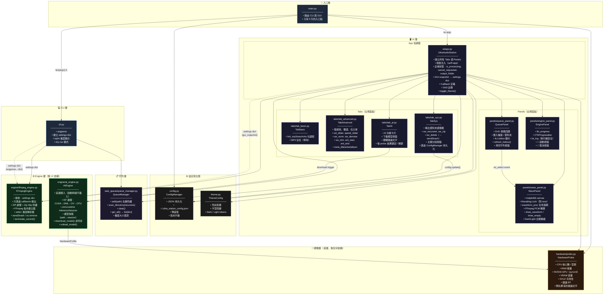
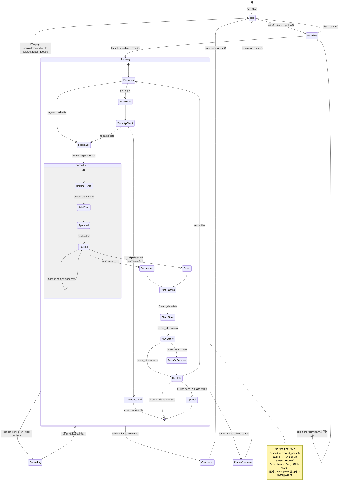
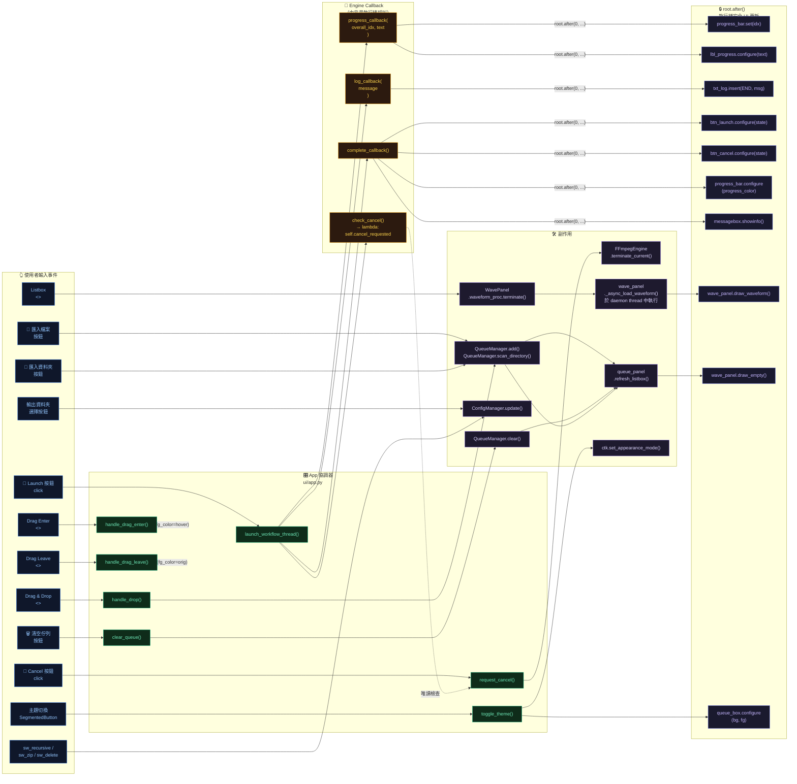

# Ultra Station — 架構設計文件（ADD）

> **版本：** v6.1.0 · **作者：** zien0709 · **狀態：** 持續更新中的文件

本文件是 `ultra_station` 專案的權威技術參考資料。
它描述了每個模組、各自職責、資料流、狀態轉換，以及相依關係，適合作為新人導覽、程式碼審查，以及未來 AI 輔助開發的基礎。

---

## 目錄

1. [🏗️ 整體架構](#chapter-1--整體架構)
2. [🚀 啟動流程](#chapter-2--啟動流程)
3. [🔄 編碼管線流程](#chapter-3--編碼管線流程)
4. [🧵 佇列狀態機](#chapter-4--佇列狀態機)
5. [📡 訊號與事件路由](#chapter-5--訊號與事件路由)
6. [📦 完整依賴圖](#chapter-6--完整依賴圖)

---

## Chapter 1 · 🏗️ 整體架構

這張圖展示了專案的 **完整靜態結構**：
包含所有模組、層級邊界、協調模式，以及將 GUI、CLI 與 Engine 解耦的統一 `settings dict` 介面。



### 設計不變式

| 規則                   | 說明                                                                                 |
| -------------------- | ---------------------------------------------------------------------------------- |
| **Engine 盲性**        | `FFmpegEngine` 和 `AIEngine` 永遠不會 import `ctk`、`tk` 或任何 UI 模組。                      |
| **settings dict 合約** | `FFmpegEngine.run()` 的唯一輸入就是純 `dict`。CLI 與 GUI 都會產生完全相同的 schema。                   |
| **只透過 callback 輸出**  | Engine 不直接輸出任何內容，只會透過 `progress_callback`、`log_callback`、`complete_callback` 回傳結果。 |
| **硬體層隔離**            | `hardware/probe.py` 與任何其他內部模組之間完全沒有 import。                                        |
| **AI 延遲載入**          | 啟動時不會 import 任何 AI 函式庫（torch、onnxruntime、demucs）。                                  |

---

## Chapter 2 · 🚀 啟動流程

這張序列圖涵蓋 **CLI 與 GUI 兩條啟動路徑**，包括硬體探測、設定載入、AI 延遲載入策略，以及例外處理。

```mermaid
sequenceDiagram
    autonumber
    actor User
    participant main as main.py
    participant cfg as config.py<br/>ConfigManager
    participant probe as hardware/probe.py<br/>HardwareProbe
    participant cli as cli.py
    participant app as ui/app.py<br/>UltraAudioStation
    participant tabs as ui/tabs/*
    participant panels as ui/panels/*
    participant ffeng as engine/ffmpeg_engine.py
    participant aieng as engine/ai_engine.py

    User->>main: python main.py [args?]

    rect rgb(20, 30, 48)
        Note over main,cfg: Phase 1 · 設定與硬體（永遠執行）
        main->>cfg: ConfigManager()
        cfg->>cfg: load ~/.ultra_station_config.json
        cfg-->>main: settings restored

        main->>probe: probe_hardware()
        probe->>probe: psutil · RAM, CPU
        probe->>probe: pynvml · NVIDIA GPU + VRAM
        probe->>probe: wmic · DX12 availability (Windows)
        probe->>probe: _build_recommendation()
        probe-->>main: HardwareProfile{ep, advisory_text}
    end

    alt CLI 模式 · len(sys.argv) > 1

        rect rgb(10, 28, 18)
            Note over main,ffeng: Phase 2A · CLI 執行
            main->>cli: parse_and_run(argv[1:])
            cli->>cli: argparse · parse flags
            cli->>cli: build settings dict
            cli->>cli: QueueManager · scan inputs
            cli->>ffeng: FFmpegEngine(profile)
            cli->>ffeng: engine.run(queue, settings,\nprogress_cb, log_cb, cancel_fn)
            ffeng-->>cli: （阻塞執行，直到完成）
            cli-->>User: tqdm 進度與摘要
        end

    else GUI 模式 · no args

        rect rgb(18, 18, 40)
            Note over main,panels: Phase 2B · GUI 啟動
            main->>app: launch_gui() → ModernApp() → UltraAudioStation(root)
            app->>cfg: config.get() · restore theme / output_folder
            app->>probe: （profile 已在記憶體中）
            app->>ffeng: FFmpegEngine() · verify get_exe()

            Note over ffeng: 若缺少 FFmpeg 會丟出例外 → 顯示錯誤對話框

            app->>tabs: TabBasic / TabAdvanced / TabAI / TabSys
            tabs->>cfg: read saved switch states → .select()
            tabs-->>app: widgets created, self refs stored

            app->>panels: QueuePanel / WavePanel / EnginePanel
            panels-->>app: cards positioned in grid

            app->>app: root.drop_target_register(DND_FILES)
            app->>app: dnd_bind <<Drop>> <<DragEnter>> <<DragLeave>>

            Note over aieng: AI 函式庫此時尚未匯入。<br/>TabAI 顯示為鎖定卡片。

            app-->>User: 視窗出現（約 50ms）
        end

        opt 使用者第一次點擊 AI 功能
            rect rgb(28, 10, 10)
                Note over app,aieng: Phase 3 · AI 延遲載入（按需啟動）
                app->>aieng: AIEngine(profile)
                aieng->>aieng: _resolve_ep(recommended_ep)
                aieng->>aieng: import onnxruntime（延後執行）
                aieng->>aieng: check model cache on disk
                alt 模型尚未下載
                    aieng-->>app: trigger download UI
                    app-->>User: 顯示下載進度卡片
                    aieng->>aieng: requests.get() · stream download
                    aieng->>aieng: verify file integrity (size / MD5)
                end
                aieng->>aieng: InferenceSession(model_path, providers=ep)
                aieng-->>app: model ready → unlock feature card
            end
        end

    end
```



---

## Chapter 3 · 🔄 編碼管線流程

這張流程圖記錄了 **單一編碼工作** 的完整生命週期，從使用者互動到檔案輸出，包含 ZIP 處理、Zip Slip 安全檢查、檔名碰撞防護、filter graph 建構、即時進度解析與後處理。

```mermaid
flowchart TD
    A([👆 使用者點擊 🚀 Launch]) --> B[從所有 Tabs 收集 GUI 狀態]
    B --> C{已勾選格式？}
    C -->|無| C1[⚠️ showwarning\n'至少選擇一種格式']
    C -->|有至少一種| D{已啟用 Trim？}
    D -->|是| E{parse_time\n驗證 start/end}
    E -->|格式無效| E1[⚠️ showwarning\n'時間格式無效']
    E -->|start ≥ end| E2[⚠️ showwarning\n'開始時間必須早於結束時間']
    E -->|OK| F
    D -->|否| F[建立 gui_snapshot\nsettings dict]

    F --> G[is_processing = True\n停用 Launch\n啟用 Cancel]
    G --> H[threading.Thread\ntarget=thread_task]

    H --> I["FFmpegEngine.run(\n  queue_files,\n  settings,\n  progress_callback,\n  log_callback,\n  check_cancel\n)"]

    I --> J{queue_files 中\n每個檔案}
    J --> K{check_cancel?}
    K -->|True| ABORT([🛑 中止迴圈])

    K -->|False| L{是 .zip 檔？}

    L -->|是| M[解壓到\nsrc_path + UUID_temp/]
    M --> N{Zip Slip\n路徑穿越\n檢查}
    N -->|偵測到攻擊| N1[❌ 記錄錯誤\nshutil.rmtree temp\n處理下一個檔案]
    N -->|安全| O[os.walk temp_dir\n收集媒體檔案]

    L -->|否| P[files_to_process\n= src]
    O --> P

    P --> Q{每個 current_file}
    Q --> R{check_cancel?}
    R -->|True| ABORT

    R -->|False| S{每個目標格式}
    S --> T{check_cancel?}
    T -->|True| ABORT

    T -->|False| U[產生 out_name\nbase_name.fmt]
    U --> V{與輸入路徑相同？}
    V -->|是| V1[重新命名：\nbase_name_converted.fmt]
    V -->|否| W
    V1 --> W{輸出路徑\n已存在？\n或已在 converted list？}
    W -->|是| W1[counter += 1\nbase_name_N.fmt]
    W1 --> W
    W -->|否，安全| X[建立 FFmpeg cmd]

    X --> X1["-y" 旗標]
    X1 --> X2{已啟用 trim？}
    X2 -->|是| X3["-ss start\n-to end"\n放在 -i 前面]
    X2 -->|否| X4
    X3 --> X4["-i current_file"]
    X4 --> X5{音訊濾鏡？}
    X5 -->|volume ≠ 1.0| XF1["volume=N"]
    X5 -->|denoise| XF2["afftdn=nr=12:nt=w"]
    X5 -->|normalize| XF3["loudnorm=I=-16:TP=-1.5:LRA=11"]
    X5 -->|speed ≠ 1.0| XF4["atempo=N"]
    XF1 & XF2 & XF3 & XF4 --> X6["-filter:a\n合併 chain"]
    X5 -->|無| X6
    X6 --> X7{sample_rate?}
    X7 -->|非保留原始| X8["-ar Hz"]
    X7 -->|保留| X9
    X8 --> X9{channels?}
    X9 -->|Mono| X10["-ac 1"]
    X9 -->|Stereo| X11["-ac 2"]
    X9 -->|保留| X12
    X10 & X11 --> X12{格式 codec}
    X12 -->|mp3| XC1["-acodec libmp3lame\n-b:a bitrate"]
    X12 -->|m4a| XC2["-acodec aac\n-b:a bitrate"]
    X12 -->|wav| XC3["-acodec pcm_s16le"]
    XC1 & XC2 & XC3 --> X13{Metadata？}
    X13 -->|title/artist/album 已設定| X14["-metadata key=val"]
    X13 -->|空白| X15
    X14 --> X15[Append final_out_path]

    X15 --> Y["subprocess.Popen\nstderr=PIPE\nencoding=utf-8"]

    Y --> Z{逐行讀取 stderr}
    Z --> AA{"'Duration:'\n在這一行？"}
    AA -->|是| AB[Parse HH:MM:SS.cc\n→ duration_seconds]
    AB --> AC{trim 模式？}
    AC -->|是| AD[重新計算：\ntrim_end - trim_start]
    AC -->|否| AE
    AD --> AE
    AA -->|否| AE{"'time=' 在這一行\n且 duration > 0?"}
    AE -->|是| AF[Parse curr_seconds\nfile_progress = curr/dur\noverall_idx = f_idx/total + ...\nspeed_str from regex]
    AF --> AG["progress_callback(\n  overall_idx,\n  '({N}%) speed: Xx'\n)"]
    AG --> Z
    AE -->|否| Z
    Z -->|EOF| AH[process.wait()]

    AH --> AI{returncode == 0?}
    AI -->|0 · 成功| AJ[log ✅ out_name\nconverted_files.append]
    AI -->|非 0| AK{check_cancel?}
    AK -->|是| AL[刪除部分輸出檔\nlog 🛑]
    AK -->|否| AM[log ❌ returncode]

    AJ & AL & AM --> AN{還有其他格式？}
    AN -->|是| S
    AN -->|否| AO{還有其他檔案？}
    AO -->|是| Q
    AO -->|否| AP{temp_dir 存在？}
    AP -->|是| AQ[shutil.rmtree temp_dir]
    AP -->|否| AR

    AQ --> AR{delete_after\n且不是 zip\n且未取消？}
    AR -->|是| AS{send2trash\n可用？}
    AS -->|是| AT[send2trash src\nlog 🗑️ → 資源回收筒]
    AS -->|否| AU[os.remove src\nlog ⚠️ 永久刪除]
    AR -->|否| AV
    AT & AU --> AV
    AV --> AW{zip_after\n且 converted_files\n且未取消？}
    AW -->|是| AX[ZipFile.write\n全部 converted_files\n工作站批次產出包裹.zip]
    AW -->|否| AY

    AX --> AY([complete_callback])

    AY --> AZ{cancelled?}
    AZ -->|是| BA[lbl: 🛑 Terminated\nprogress_bar: red]
    AZ -->|否| BB[lbl: 🎉 Complete\nprogress_bar: green → 1.0\nclear_queue]
    BA & BB --> BC[恢復按鈕狀態：\nLaunch=normal\nCancel=disabled]
    BC --> BD[showinfo dialog]
    BD --> BE([is_processing = False])
```

---

## Chapter 4 · 🧵 佇列狀態機

這張狀態圖記錄了 **QueueManager 與其項目可能處於的每一種狀態**，包含架構中已預留的未來狀態（Paused、Retry）。



### 佇列項目 schema

每個儲存在 `QueueManager.files` 的項目都遵守以下格式：

```python
{
    "src":  str,   # 絕對路徑：來源檔案
    "name": str,   # os.path.basename(src)
    "size": str    # "{N:.2f} MB"（已預先格式化供顯示）
}
```

---

## Chapter 5 · 📡 訊號與事件路由

這張圖展示了 **每個使用者互動** 如何完整傳遞到系統內部，從 widget 事件一路到最終 UI 更新，包含透過 `root.after()` 回到主執行緒的安全更新流程。



### 執行緒安全規則

| 位置                                 | 執行緒              | 可做的事                               |
| ---------------------------------- | ---------------- | ---------------------------------- |
| `FFmpegEngine.run()`               | 背景 daemon thread | 絕不能直接碰 `ctk` / `tk` widget         |
| `WavePanel._async_load_waveform()` | 背景 daemon thread | 絕不能直接呼叫 `canvas.draw()`            |
| 所有 `root.after(0, fn, args)`       | 排程到主執行緒          | 更新 widget 的唯一安全方式                  |
| `check_cancel()` lambda            | 背景執行緒讀取          | `cancel_requested` 是純 `bool`，可直接讀取 |
| `waveform_proc` 存取                 | 背景執行緒寫入          | 受 `threading.Lock` 保護              |

---

## Chapter 6 · 📦 完整依賴圖

這張圖呈現專案中 **所有 import 關係**，包含內部模組與外部 pip 套件，讓相依性稽核、打包與環境建置都能明確無誤。

```mermaid
graph TB
    subgraph PIP_CORE["📦 pip · 核心（永遠安裝）"]
        PKG_CTK["customtkinter"]
        PKG_TK["tkinter\n(stdlib)"]
        PKG_DND["tkinterdnd2"]
        PKG_IMAGEIO["imageio-ffmpeg"]
        PKG_NUMPY["numpy"]
        PKG_MPL["matplotlib"]
        PKG_PIL["Pillow"]
        PKG_S2T["send2trash"]
        PKG_PSUTIL["psutil"]
        PKG_PYNVML["pynvml"]
        PKG_TQDM["tqdm"]
        PKG_REQ["requests"]
        PKG_ARG["argparse\n(stdlib)"]
        PKG_JSON["json\n(stdlib)"]
        PKG_RE["re / uuid / shutil\n/ zipfile / subprocess\n(stdlib)"]
    end

    subgraph PIP_AI["📦 pip · AI 套件包（可選，延遲載入）"]
        PKG_ORT_DML["onnxruntime-directml\n(Windows · DX12 GPU + NPU)"]
        PKG_ORT_GPU["onnxruntime-gpu\n(CUDA · NVIDIA)"]
        PKG_ORT_OV["onnxruntime-openvino\n(Intel NPU/GPU)"]
        PKG_ORT_CPU["onnxruntime\n(CPU fallback)"]
        PKG_DEMUCS["demucs\n(vocal separation)"]
        PKG_WHISPER["faster-whisper\n(auto subtitle)"]
        PKG_REMBG["rembg\n(background removal)"]
        PKG_DFN["deepfilternet\n(AI denoising)"]
    end

    subgraph INT_ROOT["🗂️ 內部 · Root"]
        MAIN["main.py"]
        CLI["cli.py"]
        THEME["theme.py"]
        CONFIG["config.py"]
    end

    subgraph INT_HW["🗂️ 內部 · hardware/"]
        PROBE["probe.py"]
    end

    subgraph INT_ENG["🗂️ 內部 · engine/"]
        FFENG["ffmpeg_engine.py"]
        AIENG["ai_engine.py"]
    end

    subgraph INT_QUEUE["🗂️ 內部 · task_queue/"]
        INIT_Q["__init__.py"]
        QM["queue_manager.py"]
    end

    subgraph INT_UI["🗂️ 內部 · ui/"]
        APP["app.py"]
        subgraph INT_TABS["tabs/"]
            T1["tab_basic.py"]
            T2["tab_advanced.py"]
            T3["tab_ai.py"]
            T4["tab_sys.py"]
        end
        subgraph INT_PANELS["panels/"]
            P1["queue_panel.py"]
            P2["wave_panel.py"]
            P3["engine_panel.py"]
        end
    end

    %% ── 外部 → hardware ────────────────────────────────
    PKG_PSUTIL --> PROBE
    PKG_PYNVML --> PROBE
    PKG_RE --> PROBE

    %% ── 外部 → engine ─────────────────────────────────
    PKG_IMAGEIO --> FFENG
    PKG_S2T --> FFENG
    PKG_RE --> FFENG
    PKG_ORT_DML & PKG_ORT_GPU & PKG_ORT_OV & PKG_ORT_CPU -.->|"延遲匯入\n一次只啟用一種"| AIENG
    PKG_REQ --> AIENG
    PKG_DEMUCS & PKG_WHISPER & PKG_REMBG & PKG_DFN -.->|"延遲匯入\n依功能而定"| AIENG

    %% ── 外部 → queue ──────────────────────────────────
    PKG_RE --> QM

    %% ── 外部 → CLI ────────────────────────────────────
    PKG_ARG --> CLI
    PKG_TQDM --> CLI

    %% ── 外部 → UI ─────────────────────────────────────
    PKG_CTK --> APP & T1 & T2 & T3 & T4 & P1 & P2 & P3
    PKG_TK --> APP & P1 & P2
    PKG_DND --> APP
    PKG_NUMPY --> P2
    PKG_MPL --> P2
    PKG_PIL --> P1
    PKG_JSON --> CONFIG

    %% ── 內部：Root ────────────────────────────────────
    MAIN --> CLI
    MAIN --> APP
    MAIN --> CONFIG
    MAIN --> PROBE

    CLI --> QM
    CLI --> FFENG

    %% ── 內部：App → 全部 ────────────────────────
    APP --> CONFIG
    APP --> THEME
    APP --> PROBE
    APP --> FFENG
    APP --> AIENG
    APP --> QM
    APP --> T1 & T2 & T3 & T4
    APP --> P1 & P2 & P3

    %% ── 內部：跨模組 ────────────────────────────
    T3 --> AIENG
    T4 --> CONFIG
    P1 --> QM
    P2 --> FFENG
    P3 --> FFENG & AIENG
    AIENG --> PROBE
    INIT_Q --> QM

    classDef pip_core fill:#1e293b,stroke:#475569,color:#94a3b8
    classDef pip_ai fill:#1a0f2e,stroke:#7c3aed,color:#c4b5fd
    classDef int_root fill:#0f172a,stroke:#3b82f6,color:#93c5fd
    classDef int_hw fill:#2c1a0f,stroke:#f59e0b,color:#fcd34d
    classDef int_eng fill:#0f2c1a,stroke:#10b981,color:#6ee7b7
    classDef int_q fill:#1e1a2e,stroke:#a78bfa,color:#ddd6fe
    classDef int_ui fill:#1a1a2e,stroke:#818cf8,color:#a5b4fc

    class PKG_CTK,PKG_TK,PKG_DND,PKG_IMAGEIO,PKG_NUMPY,PKG_MPL,PKG_PIL,PKG_S2T,PKG_PSUTIL,PKG_PYNVML,PKG_TQDM,PKG_REQ,PKG_ARG,PKG_JSON,PKG_RE pip_core
    class PKG_ORT_DML,PKG_ORT_GPU,PKG_ORT_OV,PKG_ORT_CPU,PKG_DEMUCS,PKG_WHISPER,PKG_REMBG,PKG_DFN pip_ai
    class MAIN,CLI,THEME,CONFIG int_root
    class PROBE int_hw
    class FFENG,AIENG int_eng
    class INIT_Q,QM int_q
    class APP,T1,T2,T3,T4,P1,P2,P3 int_ui
```



### ORT 套件互斥規則

以下套件在同一個環境中 **只能安裝其中一種**：

| 套件                     | 後端             | 覆蓋範圍                                | 適用時機                      |
| ---------------------- | -------------- | ----------------------------------- | ------------------------- |
| `onnxruntime-directml` | DirectML（DX12） | AMD + Intel + NVIDIA + Qualcomm NPU | **Windows 預設** — GPU 覆蓋最廣 |
| `onnxruntime-gpu`      | CUDA           | 只有 NVIDIA                           | 使用 NVIDIA 且有 CUDA 工具鏈時    |
| `onnxruntime-openvino` | OpenVINO       | Intel CPU + GPU + NPU               | Intel-only 且使用 NPU 的機器    |
| `onnxruntime`          | CPU            | 任意機器                                | 後備 / CI 環境                |

`AIEngine._resolve_ep()` 會根據 `HardwareProfile.recommended_ep` 在執行時建立正確的 provider list。

---

## 附錄 · 模組職責矩陣

| 模組                            | 是否 import UI？ | 是否 import Engine？ | 是否 import Hardware？ |        是否有狀態？       |
| ----------------------------- | :-----------: | :---------------: | :-----------------: | :-----------------: |
| `main.py`                     |    ✅（只在啟動時）   |     ✅（透過 cli）     |          ✅          |          ❌          |
| `cli.py`                      |       ❌       |         ✅         |          ❌          |          ❌          |
| `theme.py`                    |       ❌       |         ❌         |          ❌          |          ❌          |
| `config.py`                   |       ❌       |         ❌         |          ❌          |        ✅ JSON       |
| `hardware/probe.py`           |       ❌       |         ❌         |          —          |          ❌          |
| `engine/ffmpeg_engine.py`     |       ❌       |         —         |          ❌          | ✅ `current_process` |
| `engine/ai_engine.py`         |       ❌       |         —         |          ✅          |   ✅ session cache   |
| `task_queue/queue_manager.py` |       ❌       |         ❌         |          ❌          |    ✅ `files` list   |
| `ui/app.py`                   |       ✅       |         ✅         |          ✅          |        ✅ 全域狀態       |
| `ui/tabs/*`                   |       ✅       |         ❌         |          ❌          |    ✅ widget refs    |
| `ui/panels/*`                 |       ✅       |   ✅（wave/engine）  |          ❌          |    ✅ widget refs    |

> **零依賴規則：** 任何被標示為在「是否 import UI？」與「是否 import Engine？」都為 ❌ 的模組，都可以在沒有顯示伺服器的純 Python 環境中進行單元測試——這是 CI pipeline 與 CLI headless server 部署的重要條件。

---